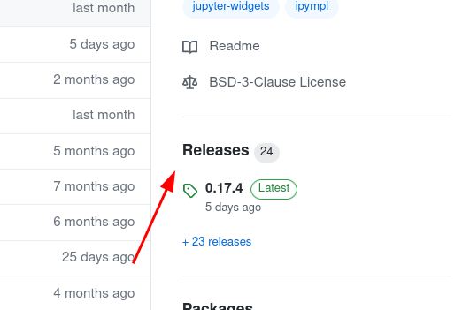
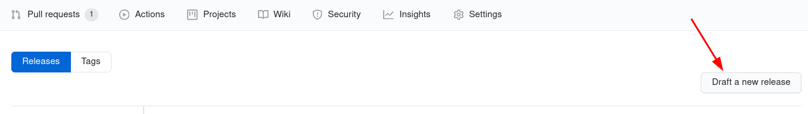

# Matplotlib 3rd Party Package Cookiecutter

Turn your matplotlib convenience scripts into a proper python package using this cookiecutter. 
```
pip install cookiecutter
cookiecutter gh:matplotlib/matplotlib-extension-cookiecutter
```
**Buy why?**

Why use this over just starting with a setup.py? This cookiecutter will provide the infrastructure of open-source project quickly, you can set all this up on your own, but it will take time and can be annoying to get right. With the cookiecutter you get:

- Github actions works
- Issue Templates
- Properly set up packaging 
- A setup for docs with:
    - `sphinx-gallery`
    - `autodoc`
- The set up for `pytest-mpl`


## Building docs
```
cd docs
make watch
```

## Setting up readthedocs

Readthedocs is a website that hosts the docs for many projects in the Python ecosystem. You can integrate them with your repo by following the instructions here: https://docs.readthedocs.io/en/stable/webhooks.html

You can also have readthedocs make test builds on PRs by following the instructions here: https://docs.readthedocs.io/en/latest/pull-requests.html
## Setting up tests

The best way to do testing for a Matplotlib extension is to use [pytest-mpl](https://github.com/matplotlib/pytest-mpl#about). This project inclues a basic test, but does not pregenerate any baselines images. To make the example test work you first need to generate the baseline with:

```
pytest --mpl-generate-path=<package-name>/tests/baseline
```

For full instructions see: https://github.com/matplotlib/pytest-mpl#using

## Publicizing your package

Once you've made your package other people will likely want to use your hard work, and maybe even contribute to it! But for this to happen they need to know about it. The Matplotlib devs also want you to share your package and like to amplify your advertising. So some great steps to take in order to share your package are:

1. Make a PR to add it to Matplotlib's 3rd party packages page
   - [Example PR](https://github.com/matplotlib/matplotlib/pull/13076)
2. Tweet about your pacakge and and mention `@matplotlib` for a retweet.


## Miscellaneous Advice

Do not use Matplotlib private methods. If you really need the functionality then consider opening a feature request to have Matplotlib provide a public API for what you want.

There is some discussion of how to use Matplotlib docstrings on discourse: https://discourse.matplotlib.org/t/docs-for-a-method-wrapping-a-matplotlib-method/21055

https://colcarroll.github.io/yourplotlib/ is a great read for how to make an extension to Matplotlib.

## LICENSE Advice

You may end up using portions of Matplotlib's code or copying docstrings when making a Matplotlib extension.

As a practical rule: If you end up copying a non-trivial amount of code or docs the safest course of action is to add the Matplotlib license to your project as a derived work. For example see how Matplotlib does it https://github.com/matplotlib/matplotlib/tree/master/LICENSE.

> But what counts as non-trivial?


A good rule of thumb is to ask yourself:

    If it were homework and you didn't acknowledge would it be cheating?

If the answer is yes, then you should leave a comment in the code and include a license file in a top level `LICENSE` folder.


## Releasing to PyPi
### Manually
First set ensure you have the right packages installed:
```
pip install build twine
```

Then generate an `sdist` and a `wheel`:

1. bump version in `_version.py`
2. `git add <...>/_version.py`
3. `commit -m 'version bump'`
4. `git tag <version number>`
5. `git push --tags`
6. `python -m build -sdist -wheel`
7. `twine upload dist/*`


### Using Github Actions
If you use Github as your Git repository then you can also automate steps 4-7 by using the Github action included in the cookiecutter. 

To do this you will need to generate a PyPI api token and add it to your repository's secrets.

**Generating an api token**

Go to you [PyPI account setttings](https://pypi.org/manage/account/), scroll down to the API tokens section and select "Add API token".

**Adding api token to Github Secrets**
Once you've have copied the token from PyPI go the `Secrets` section of your Github repo's settings and add the token with the name `PYPI_API_TOKEN`


With that set up all you need to do to create a release is:
1. bump version in `_version.py`
2. `git add <...>/_version.py`
3. `git commit -m 'version bump' && git push`
4. Make a release using the github release tool.

To make the release go the the `Releases` section in the repo sidebar:



then draft a new release:



After you fill out the information the Github action will create a new tag for you, build the wheel, and upload it to PyPI.


## Credit

This cookiecutter is partially based on the following cookiecutters
- https://github.com/jupyter-widgets/widget-ts-cookiecutter
- The `setup.cfg` from https://github.com/napari/napari

----
Happy Plotting!
