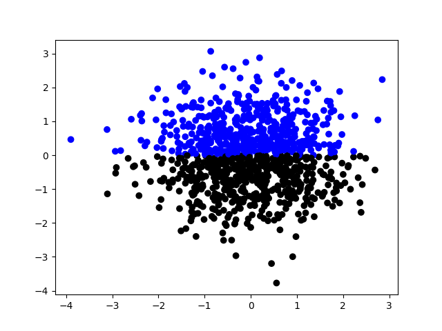

Welcome to {{ cookiecutter.python_package_name }}'s documentation!
===================================================================

A library makes for making awesome plots like this one:

Installation
^^^^^^^^^^^^^

.. code-block:: bash

   pip install {{ cookiecutter.python_package_name }}

Getting Help
^^^^^^^^^^^^

If you have a question on how to do something with ``{{ cookiecutter.python_package_name }}`` a great place
to ask it is: https://discourse.matplotlib.org/c/3rdparty/18.

.. toctree::
   :maxdepth: 3

   examples/index
   API
   Contributing

Indices and tables
==================

* :ref:`genindex`
* :ref:`modindex`
* :ref:`search`
